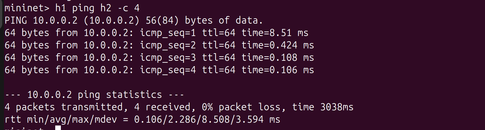
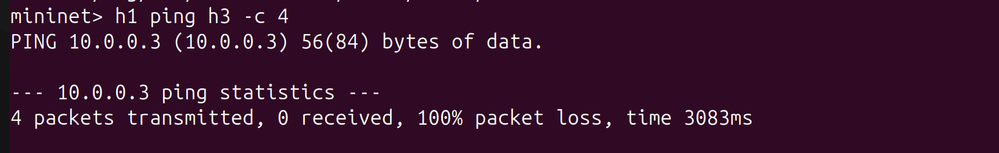
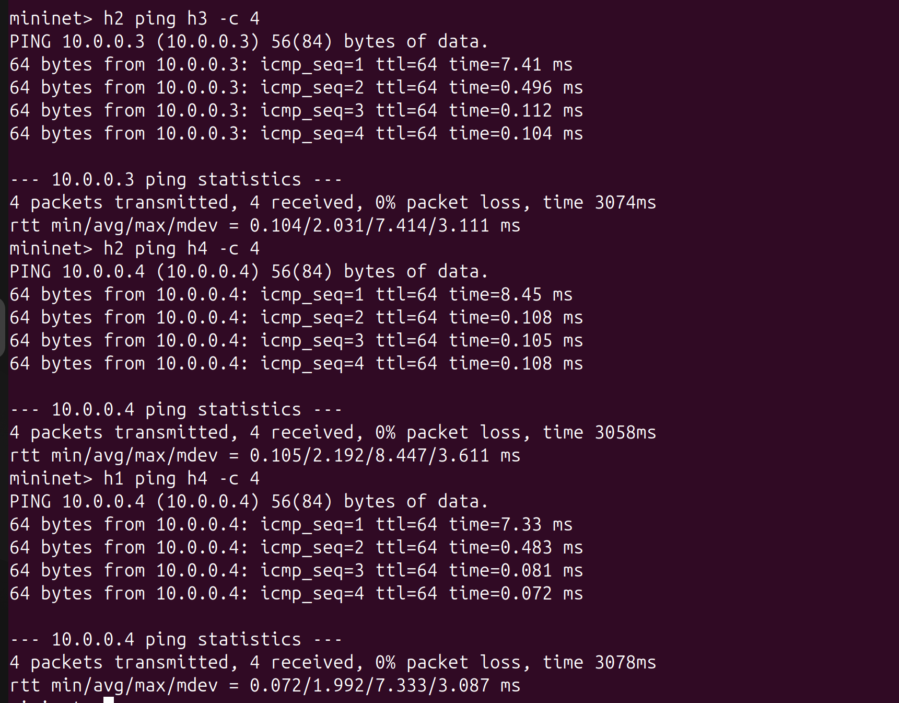
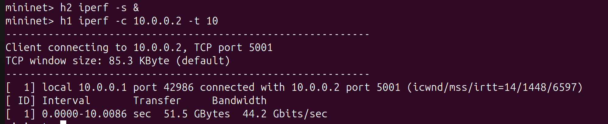
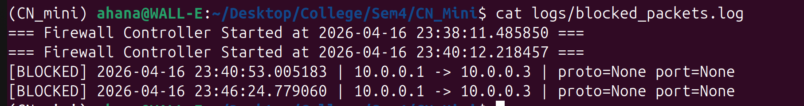

# SDN-Based Firewall using Ryu + Mininet

A controller-based firewall that blocks or allows traffic between hosts using OpenFlow flow rules, with packet logging.

---

## Topology

```
        [ Ryu Controller ]
               |
           [ s1 (OVS Switch) ]
          /    |    \    \
        h1    h2    h3    h4
    10.0.0.1 10.0.0.2 10.0.0.3 10.0.0.4
```

## Firewall Rules

| Source IP | Destination IP | Protocol | Port | Action |
|-----------|----------------|----------|------|--------|
| 10.0.0.1 | 10.0.0.3 | Any | Any | BLOCK |
| Any | 10.0.0.4 | TCP | 80 | BLOCK |
| Any | Any | Any | Any | ALLOW |

---

## Setup

```bash
# Install dependencies
sudo apt-get install mininet
pip install ryu

# Create logs folder
mkdir -p logs
```

---

## Running the Project

**Terminal 1 — Start controller:**
```bash
ryu-manager firewall_controller.py --verbose
```

**Terminal 2 — Start topology:**
```bash
sudo mn -c
sudo python3 firewall_topology.py
```

**Inside Mininet CLI:**
```bash
mininet> h1 ping h2 -c 4     # ALLOWED
mininet> h1 ping h3 -c 4     # BLOCKED
mininet> h2 ping h3 -c 4     # ALLOWED
mininet> h2 iperf -s &
mininet> h1 iperf -c 10.0.0.2 -t 10
mininet> dpctl dump-flows
```

---

## Expected Output

| Test | Expected |
|------|----------|
| h1 → h2 | 0% packet loss (allowed) |
| h1 → h3 | 100% packet loss (blocked) |
| h2 → h3 | 0% packet loss (allowed) |

---

## Screenshots

### Allowed Traffic


### Blocked Traffic


### Connectivity Validation


### Performance Test


### Firewall Logs


---
